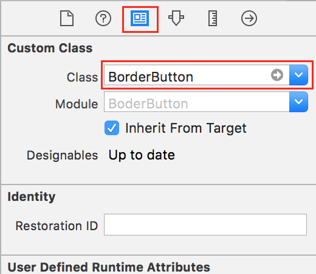
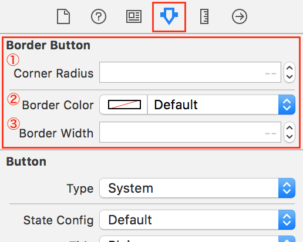
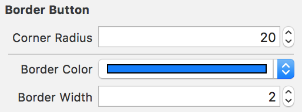
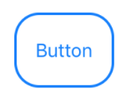
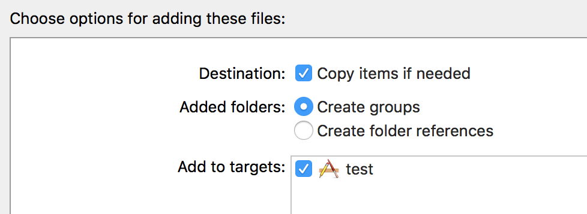

# 角丸ボタンをStoryBoardからデザインできるようにする

## 概要  

角丸ボタンを作成しようとしている時にStoryboardから設定できる方法がありました。  
最新のSwift3.1対応に書き換えたのでアップしました。  

## 簡単な流れ

UIButtonクラスをオーバーライドしたBorderButtonクラスを作成します。  

UIButtonを配置した後、Identity InspectorにあるCustomClassにBorderButtonを指定します。  

Attribute InspectorにBorderButtonの項目が増えて視覚的に選択できるようになります。  
各パラメータは以下の通りです。  

①枠線の角度  
②枠線の色  
③枠線の太さ  

## 設定例

## プロジェクトファイルへのインポート方法

BorderButton.swiftを各自のプロジェクトにドラッグ＆ドロップしてください。  
この時に「Copy items if needed」にチェックをつけてください。  

## 参考サイト

[角丸で枠線のUIButtonを作る](http://qiita.com/hatapu/items/99e6a8b19f890f0fec9f)  

## これからつくるiPhoneアプリ開発入門 ~Swiftではじめるプログラミングの第一歩~

おすすめSwift 3.0向け入門書です。  
[公式サイト](https://swiftbg.github.io/swiftbook/)  

